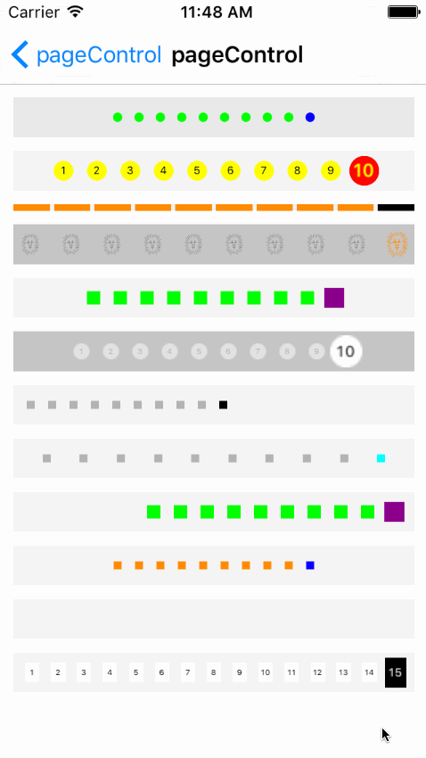

# SYPageControl
自定义多样式页签控制视图组件

根据需要进行自定义显示
* 形状
  * 方形
  * 圆形
  * 线条图
  * 图标
* 对齐
  * 居中对齐
  * 左对齐
  * 右对齐
  * 均等对齐
* 特效
  * 页签数码
  * 高亮时放大
  * 适配图标大小

效果图

代码示例

导入项目
~~~ javascript
pod 'SYPageControl'
~~~

~~~ javascript
// 导入头文件
#import "SYPageControl.h"

// 实例化
SYPageControl *pageControl = [[SYPageControl alloc] initWithFrame:CGRectMake(10.0, 10.0, (self.view.frame.size.width - 10.0 * 2), 30.0)];
[self.view addSubview:pageControl];
pageControl.backgroundColor = [UIColor colorWithWhite:0.5 alpha:0.1];

// 页码设置
pageControl.numberOfPages = 10;
pageControl.currentPage = 2;

// 显示样式
pageControl.pageControlType = SYPageControlTypeCircle;

// 对方方式
pageControl.pageControlAlignment = SYPageControlAlignmentLeft;

// 页码颜色
pageControl.pageIndicatorColor = [UIColor yellowColor];
pageControl.currentPageIndicatorColor = [UIColor redColor];

// 页码图标
pageControl.pageIndicatorImage = [UIImage imageNamed:@"pageCircle_normal"];
pageControl.currentPageIndicatorImage = [UIImage imageNamed:@"pageCircle_selected"];

// 页码序号
pageControl.showPageNumber = YES;
pageControl.pageNumberColor = [UIColor blackColor];
pageControl.pageNumberFont = [UIFont systemFontOfSize:8.0];
pageControl.currentPageNumberColor = [UIColor yellowColor];
pageControl.currentPageNumberFont = [UIFont boldSystemFontOfSize:9.0];

// 页码大小
pageControl.pageSizeWidth = 15.0;
pageControl.pageSizeHeight = 15.0;

// 页码高亮放大
pageControl.transformScale = 1.5;

// 总数为1时，是否隐藏不显示
pageControl.hidesForSinglePage = YES;

// 适配图标大小
pageControl4.shouldAutoresizingImage = YES;

~~~

~~~ javascript
// 或使用链式属性设置
SYPageControl *pageControl = [[SYPageControl alloc] initWithFrame:CGRectMake(10.0, 10.0, (self.view.frame.size.width - 10.0 * 2), 30.0)];
[self.view addSubview:pageControl];
pageControl.backgroundColor = [UIColor colorWithWhite:0.5 alpha:0.1];
pageControl.pages(15).page(10).pageScale(1.5).showPageIndex(YES).pageIndexColor([UIColor blackColor]).currentPageIndexColor([UIColor whiteColor]).pageAlignment(SYPageControlAlignmentEqual).pageType(SYPageControlTypeSquare).pageColor([UIColor whiteColor]).currentPageColor([UIColor blackColor]).pageHeight(15.0).pageWidth(30.0);
~~~

> 使用注意
> * 设置了图标，则颜色失效
> * 设置图标时，显示样式必须为 SYPageControlTypeImage

### 修改完善
* 20170830
  * 版本号：1.1.0
  * 修改优化
    * 线条样式时：线条长度异常处理
    * 添加线条样式时底端对齐

* 20170720
  * 1.0.0 
    * 添加源码
  * 1.0.1 
    * 修改页码数显示异常
    * 页码序号自适应 adjustsFontSizeToFitWidth
    * 重置视图时，清空子视图
    * 默认透明背景色

